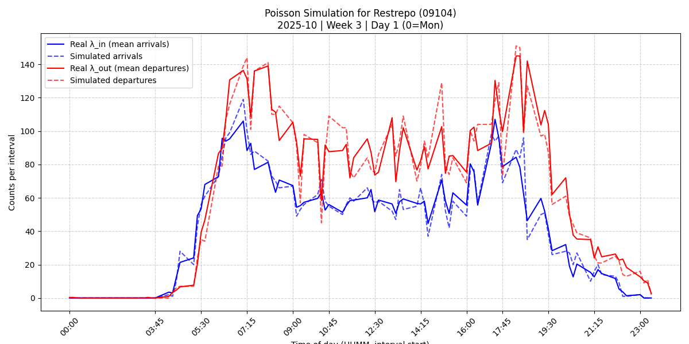
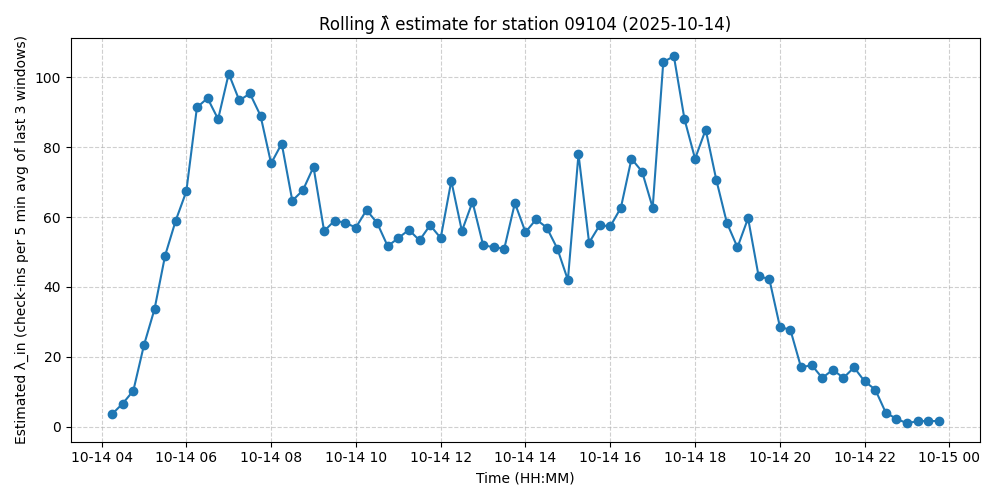
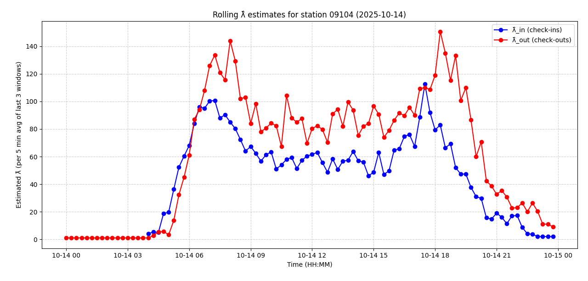
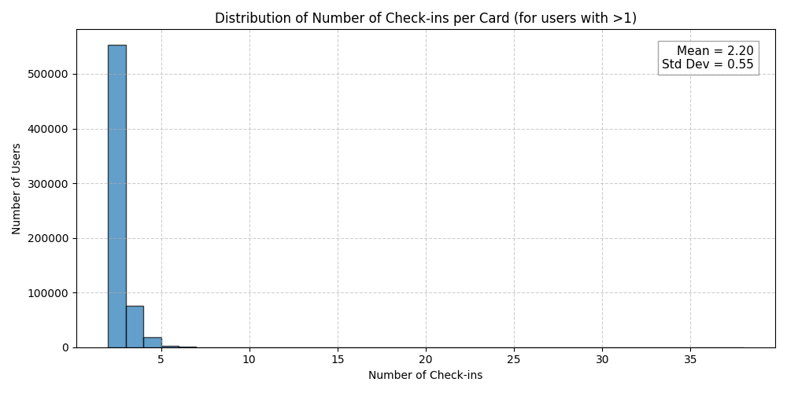
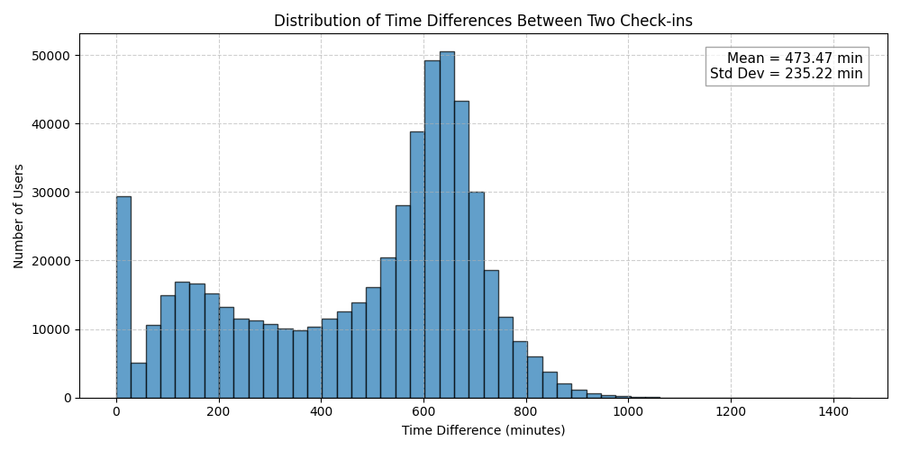

## Simulated Estimates: Restrepo 2025-10-14

## Real Check Ins Rolling Estimates: Restrepo 2025-10-14

## Synthetic Check Ins/Outs Rolling Estimates: Restrepo 2025-10-14

## Multiple Check Ins > 1 Distribution: 2025-10-14

## Time Between 2 Check Ins Distribution: 2025-10-14

## Mental Model
- Daily Check Ins (1 row, 1 check in)
    - Historic Estimates (avg check ins in 5 min, 15 min steps) per (Station, Time)
        - Synthetic Check Ins (for simulation)
    - Rolling Estimates (avg check ins in 5 min, last 15 min) per (Station)
- Daily Check Outs (1 row, n check outs per device in 15 min)
    - Historic Estimates (uniform assumption, divide by 3)
        - Synthetic Check Outs (for simulation, rolling estimates)

## TODO
- Assumptions to Validate:
    - Seasonal Non-Homogeneus Poisson Process
    - Test Hypothesis, Cluster, Correlate Times Series (?)
    - Estimate \lambda(t) with GLM (?)

- To Explore:
    - Feasibility of Historic OD based on real data
    - Feasibility of Real-Time OD based on real data
    - OD Estimation - Other Approaches: Flows (Ins/Outs)
    - Dynamic/Time Varying OD
    - Potential Routes from OD