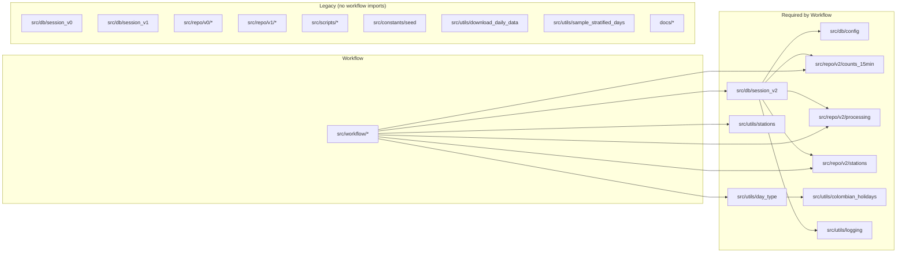

# Legacy Code Analysis

## Dependency Graph

The workflow imports **exactly** these modules from outside `src/workflow/`:



## Classification

### ✅ Keep — Required by Workflow

| Path | Why |
|------|-----|
| `src/db/config.py` | `Base` declarative base for SQLAlchemy |
| `src/db/session_v2.py` | DB session used by `data_loader` and `step4` |
| `src/repo/v2/counts_15min/` | Count data model + repository |
| `src/repo/v2/processing/` | Processed file tracking |
| `src/repo/v2/stations/` | Station model + repository |
| `src/utils/day_type.py` | `get_day_type()` — used by step1, step4, intensity scripts |
| `src/utils/colombian_holidays.py` | Called by `day_type.py` |
| `src/utils/stations.py` | `extract_station_info()` — used by step3, step4, data_reader |
| `src/utils/logging.py` | Logger used by `session_v2.py` |
| `osltm.db` | Active database file (`DATABASE_FILE` defaults to this or `osltm_v2.db`) |

### 🗑️ Legacy — Not Imported by Workflow

| Path | What it was | Size hint |
|------|-------------|-----------|
| `src/db/session_v0.py` | Old DB session (different schema) | 1.8 KB |
| `src/db/session_v1.py` | Old DB session (different schema) | 1.8 KB |
| `src/repo/v0/` | Old repositories (estimates, processing, stations) | dir |
| `src/repo/v1/` | Old repositories (estimates, processing, stations) | dir |
| `src/scripts/analysis/` | Early analysis scripts (hawkes_fit, kde_intensity, nb_fit, self_excitation, overdispersion, time_series_clustering) | ~68 KB |
| `src/scripts/notebooks/` | Jupyter notebooks from Oct–Nov 2025 (10 date-based folders) | dir |
| `src/scripts/plot/` | Old plotting scripts (v0) | dir |
| `src/scripts/populate/` | Old DB population scripts (v0, v1, v2 — superseded by step4) | dir |
| `src/scripts/simulate/` | Simulation scripts (compute_delayed_od, estimate_lambda, estimate_synthetic_lambda) | ~13 KB |
| `src/scripts/realtime/` | Realtime estimation scripts | dir |
| `src/constants/seed.py` | Single constant `SEED = 42` (workflow uses `params.json` instead) | 11 B |
| `src/utils/download_daily_data.py` | Old download logic (superseded by step2) | 3.6 KB |
| `src/utils/sample_stratified_days.py` | Old sampling logic (superseded by step1) | 3.0 KB |
| `docs/` | Old logs, samples, todo list | dir |
| `commands-history.txt` | Command history (useful for reference, not code) | 6.5 KB |
| `osltm_v1.db` | Old database (v1 schema) | **135 MB** |
| `osltm_v2.db` | Old database (v2 schema, possibly redundant with `osltm.db`) | **17 MB** |

> [!IMPORTANT]
> `src/scripts/analysis/` contains early research code (Hawkes process fitting, negative binomial fitting, KDE intensity estimation, self-excitation analysis) that may be intellectually valuable even if not used by the workflow. Consider preserving these for reference.

## Options

### Option A: Clean this repo (recommended)

Move legacy code to an `_archive/` or `legacy/` folder (or delete), keep this repo for the workflow.

**Pros:** Simplest, preserves git history, one repo to manage.

```
osltm/
├── src/
│   ├── db/           (keep config.py + session_v2.py only)
│   ├── repo/v2/      (delete v0/, v1/)
│   ├── utils/        (keep day_type, colombian_holidays, stations, logging only)
│   └── workflow/     (unchanged)
├── _archive/         (move everything else here)
└── ...
```

### Option B: New repo for workflow

Create a fresh repo with only the workflow code + its dependencies.

**Pros:** Clean slate, no legacy baggage.
**Cons:** Lose git history, need to copy+restructure, two repos.

### Option C: Keep as-is, tag the split point

Just gitignore or tag the current state. Start fresh work in the workflow folder only.

**Pros:** Zero effort now.
**Cons:** Confusion persists, old DB files waste space.

## Quick Wins (regardless of option)

1. **Delete `osltm_v1.db` (135 MB)** — old schema, not used
2. **Delete `osltm_v2.db` (17 MB)** if `osltm.db` is your active DB
3. **Delete `src/db/session_v0.py` and `session_v1.py`** — unused
4. **Delete `src/repo/v0/` and `src/repo/v1/`** — unused
5. **Gitignore `*.db` files** if not already (they shouldn't be in version control)
