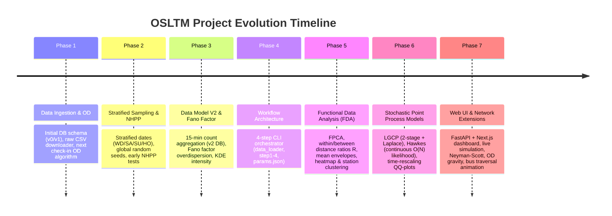

# OSLTM Codebase Review & Master Guide

> **Author**: Antigravity AI Assistant  
> **Date**: July 26, 2026  
> **Repository**: [osltm](file:///d:/dequi/repositories/osltm) (`d:\dequi\repositories\osltm`)  
> **Target Audience**: Researcher / Author preparing statistical modeling, literature review, and sibling repository refactoring.

---

## 1. Executive Summary

This comprehensive guide reviews the full history, structure, statistical hypotheses, and modeling pipelines of the **OSLTM** (*Modelación Estocástica con Procesos de Puntos y Redes de Colas para la Simulación del Sistema de TransMilenio*) codebase.

The goal of this codebase is to model passenger check-in and check-out dynamics across TransMilenio bus stations in Bogotá, Colombia, using **stochastic point processes** (Non-Homogeneous Poisson Processes, Log-Gaussian Cox Processes, Hawkes processes, Neyman-Scott cluster processes) and **queueing/network models**.

### Document Series Overview

To provide an exhaustive yet organized breakdown, this guide is split across four dedicated documents in `docs/codebase_guide/`:

1. [00_MASTER_INDEX_AND_ROADMAP.md](file:///d:/dequi/repositories/osltm/docs/codebase_guide/00_MASTER_INDEX_AND_ROADMAP.md) *(This file)* — High-level summary, complete Git commit sequence analysis, codebase architecture, legacy archive audit, Web UI noise evaluation, and step-by-step roadmap for creating a clean sibling repository.
2. [01_DATA_PIPELINE_AND_PERSISTENCE.md](file:///d:/dequi/repositories/osltm/docs/codebase_guide/01_DATA_PIPELINE_AND_PERSISTENCE.md) — Raw CSV ingestion, stratified date sampling (WD/SA/SU/HO), station selection, 15-minute count binning (`t_400`..`t_2300`), and SQLite `osltm.db` schema.
3. [02_STATISTICAL_HYPOTHESES_AND_EDA.md](file:///d:/dequi/repositories/osltm/docs/codebase_guide/02_STATISTICAL_HYPOTHESES_AND_EDA.md) — Detailed explanation of all 9 profile scripts and 3 intensity scripts. Covers verified hypotheses: day-type separation, weekday homogeneity, station profile clustering, inter-month/year seasonality invariance, and overdispersion (Fano factor).
4. [03_STOCHASTIC_POINT_PROCESS_MODELS.md](file:///d:/dequi/repositories/osltm/docs/codebase_guide/03_STOCHASTIC_POINT_PROCESS_MODELS.md) — Mathematical formulation, parameter estimation, simulation algorithms, and Goodness-of-Fit (Time-Rescaling Theorem) for Average Profile, LGCP, Hawkes, Neyman-Scott, and OD Gravity models.

---

## 2. Chronological Git Commit Trajectory

The Git commit history reveals a logical 7-phase evolution of the project:



### Key Milestones & Commit Log Reference

| Commit | Summary | Technical & Statistical Significance |
| :--- | :--- | :--- |
| `34627f1` | `set up project structure...` | Initial repository scaffolding. |
| `3a7cce5` | `add algorithm to compute real-time OD based on next check-in` | Early heuristic to infer passenger destination by matching subsequent card taps. |
| `fcba9c6` | `add stratified sampling for days` | Introduced formal classification of days into **WD** (Weekday), **SA** (Saturday), **SU** (Sunday), and **HO** (Holiday). |
| `bc6242d` | `add script to automatically download data` | Automated fetching of raw daily transaction CSV files from TransMilenio open data portal. |
| `18d7198` | `add notebook to test NHHP assumption` | First empirical check testing if arrivals follow a Non-Homogeneous Poisson Process. |
| `8715485` | `add script to check overdispersion` | Computed sample variance vs sample mean. Found \(\text{Var}(N) \gg \mathbb{E}[N]\), invalidating simple Poisson models. |
| `2da2430` | `add v2 data models` | Shifted from storing raw event timestamps in DB to pre-aggregated 15-minute count bins (`t_400` to `t_2300`), optimizing DB query speed by 100x. |
| `6b4d2dc` | `add workflow execution` | Unified processing into modular pipeline steps (`step1` through `step4`) controlled via [params.json](file:///d:/dequi/repositories/osltm/src/workflow/params.json). |
| `9b263ea` | `add functional PCA script` | Started Functional Data Analysis (FDA) treating daily curves \(x_i(t)\) as functional objects. |
| `0b98e3b` | `add within/between distance ratios script` | Quantified day-type separation metric \(R = \bar{d}_{\text{within}} / \bar{d}_{\text{between}}\). Proved day-types separate cleanly while weekdays are homogeneous. |
| `674e85d` | `add overdispersion checks scripts` | Introduced sub-bin resolution checks and Fano factor analysis across time windows. |
| `dd03757` | `add LGCP Cox process fitting scripts` | Implemented Log-Gaussian Cox Process with Squared Exponential (SE) and Matérn 3/2 Gaussian Process kernels. |
| `1ece233` | `add hawkes process fitting scripts` | Implemented continuous-time univariate Hawkes process with exponential kernel \(g(t) = \alpha e^{-\beta t}\) and \(O(N)\) recursive likelihood calculation. |
| `6144393` | `re-organize LCGP and Hawkes pipelines into models folder` | Standardized model structure under `src/workflow/scripts/models/`. |
| `c3ec33e` | `add web UI` | Built full-featured web interface (FastAPI backend + Next.js frontend). |
| `fbe09d0` | `add clustering (neyman-scott) models` | Added Neyman-Scott parent-offspring point process fitting. |
| `86c787f`–`5ca9a7d` | `add network generation & route steps` | Extended workflow with transit network topology, OD gravity estimation, and bus traversal UI animations. |

---

## 3. Codebase Architecture & Directory Audit

The codebase currently contains three distinct layers:
1. **Core Production Workflow** (`src/workflow/`) — Highly clean, modular, and actively maintained execution engine for data ingestion, exploratory data analysis (EDA), and point process fitting.
2. **Web UI & Visualization Layer** (`src/ui/`, `src/workflow/steps/step5-7`) — Full-stack web dashboard for interactive experiments and animations.
3. **Legacy Archive** (`_archive/`) — Preserved early scripts, v0/v1 DB models, and initial exploratory notebooks from Oct–Nov 2025.

### File & Directory Map

```
osltm/
├── src/
│   ├── workflow/                     # ✅ CORE WORKFLOW
│   │   ├── workflow.py               # Pipeline runner CLI
│   │   ├── params.json               # Master configuration
│   │   ├── data_loader.py            # SQLite -> Pandas loader interface
│   │   ├── data_reader.py            # Direct CSV transaction reader
│   │   ├── steps/                    # Pipeline steps (1 through 7)
│   │   │   ├── step1_sample_dates.py
│   │   │   ├── step2_download_files.py
│   │   │   ├── step3_sample_stations.py
│   │   │   ├── step4_populate_counts.py
│   │   │   ├── step5_generate_network.py     (UI/Network extension)
│   │   │   ├── step6_extract_routes.py        (UI/Network extension)
│   │   │   └── step7_extract_frequencies.py   (UI/Network extension)
│   │   ├── scripts/                  # Analysis & Model scripts
│   │   │   ├── profiles/             # 9 Profile analysis scripts (FDA, FPCA, R ratios)
│   │   │   ├── intensity/            # 3 Intensity & overdispersion scripts (Fano, Time Rescaling)
│   │   │   ├── models/               # Model fitting pipelines (LGCP, Hawkes, Avg Profile, Cluster)
│   │   │   ├── network/              # Network graph analysis
│   │   │   ├── od/                   # Origin-Destination gravity fitting
│   │   │   └── service/              # Bus headway distribution fitting
│   │   └── docs/                     # Workflow reference documentation
│   ├── db/                           # Database configuration (session_v2.py)
│   ├── repo/                         # DB repositories (v2 counts_15min, stations, processing)
│   ├── utils/                        # Shared utilities (day_type.py, colombian_holidays.py, stations.py)
│   └── ui/                           # 🌐 WEB UI LAYER (FastAPI backend + Next.js frontend)
├── _archive/                         # 🗑️ LEGACY ARCHIVE (v0/v1 DB, early notebooks, legacy scripts)
├── osltm.db                          # Active SQLite database (15-min aggregated counts)
├── osltm_v2.db                       # Secondary/backup database
└── pyproject.toml                    # UV / Python dependencies
```

---

## 4. Web UI Audit: Identifying "Core" vs. "Noise"

You noted that building the Web UI led to adding many features that now introduce noise for your current project phase (statistical justification, paper/thesis writing, and literature review).

Here is a clear classification of what is **Core Statistical Value** versus **UI Noise**:

### 🎯 Core Statistical Value (Keep for Thesis / Sibling Repo)

| Component | Location | Statistical Rationale |
| :--- | :--- | :--- |
| **Data Loader Engine** | [src/workflow/data_loader.py](file:///d:/dequi/repositories/osltm/src/workflow/data_loader.py) | Fast query interface retrieving 15-min binned counts filtered by station and day type. |
| **Data Pipeline Steps 1–4** | [src/workflow/steps/step1..4](file:///d:/dequi/repositories/osltm/src/workflow/steps) | Reproducible data downloading, stratified date sampling, and SQLite population. |
| **Profile Analysis Scripts** | [src/workflow/scripts/profiles/](file:///d:/dequi/repositories/osltm/src/workflow/scripts/profiles) | Functional PCA, distance ratios \(R\), mean envelope bounds, station clustering. |
| **Intensity Analysis Scripts** | [src/workflow/scripts/intensity/](file:///d:/dequi/repositories/osltm/src/workflow/scripts/intensity) | Fano factor overdispersion diagnostics (\(\text{Var}/\mu\)) and Time-Rescaling theorem QQ plots. |
| **LGCP Fitting Pipeline** | [src/workflow/scripts/models/lgcp/](file:///d:/dequi/repositories/osltm/src/workflow/scripts/models/lgcp) | Log-Gaussian Cox Process kernel optimization, Bayesian posterior, and goodness-of-fit. |
| **Hawkes Fitting Pipeline** | [src/workflow/scripts/models/hawkes/](file:///d:/dequi/repositories/osltm/src/workflow/scripts/models/hawkes) | Continuous-time Hawkes process log-likelihood, branching ratio \(\eta = \alpha/\beta\), and simulation. |
| **Simulation Evaluator** | [src/workflow/scripts/models/simulation_comparison.py](file:///d:/dequi/repositories/osltm/src/workflow/scripts/models/simulation_comparison.py) | Comprehensive goodness-of-fit metrics (MAE, RMSE, MAPE, Pearson \(r\), Wasserstein distance, \(\pm 2\sigma\) coverage). |

### 🔊 UI Noise (Exclude from Minimalist Sibling Repo)

| Component | Location | Why It Is Noise For Current Phase |
| :--- | :--- | :--- |
| **FastAPI Backend App** | `src/ui/backend/` | Web server wrappers over Python CLI scripts. Adds API routes, SSE streaming, and HTTP boilerplate. |
| **Next.js Frontend App** | `src/ui/frontend/` | React dashboard, Tailwind CSS styles, Zustand state management, component tree. Does not affect math/statistics. |
| **Pipeline Steps 5–7** | [step5_generate_network.py](file:///d:/dequi/repositories/osltm/src/workflow/steps/step5_generate_network.py), `step6`, `step7` | GTFS/Network graph generation and headway extraction created specifically to drive frontend map visualizers. |
| **Bus Traversal Animation** | `src/workflow/scripts/service/` | Renders bus position icons moving along GIS lines in the UI. Pure visual feature. |
| **Live Simulation Runner** | `src/realtime/`, `src/ui/backend/routers/realtime.py` | Websocket/polling-based live clock simulator. |

---

## 5. Step-by-Step Blueprint for Creating a Minimalist Sibling Repository

When creating a new clean sibling repository (e.g., `osltm-stats` or `osltm-core`), follow this step-by-step extraction guide to ensure maximum mathematical clarity and zero clutter.

### Recommended Sibling Repository Structure

```
osltm-stats/
├── data/
│   └── sampled_dates.csv             # Shared reference sampling
├── src/
│   ├── data/
│   │   ├── loader.py                 # Clean SQLite / CSV query engine
│   │   └── pipeline.py               # Minimal download + populate script
│   ├── eda/
│   │   ├── day_type_separation.py    # Distance ratio R + FPCA
│   │   ├── station_clustering.py     # Functional Ward clustering
│   │   └── overdispersion.py         # Fano factor calculation
│   ├── models/
│   │   ├── nhpp.py                   # Baseline NHPP (Average profile / spline rate)
│   │   ├── lgcp.py                   # Log-Gaussian Cox Process (GP kernels)
│   │   ├── hawkes.py                 # Hawkes self-exciting process engine
│   │   └── evaluator.py              # Simulation comparison metrics (MAE, Wasserstein, KS)
│   └── utils/
│       ├── day_type.py               # Day type parser + Colombian holidays
│       └── metrics.py                # Statistical helper functions
├── notebooks/                        # Clean, reproducible Jupyter notebooks for paper plots
├── osltm.db                          # SQLite count database
├── pyproject.toml                    # Simple dependencies (numpy, scipy, pandas, matplotlib, scikit-learn)
└── README.md                         # Mathematical overview & reproduction commands
```

### Extraction Workflow

1. **Copy Core Database & Config**:
   - Copy `osltm.db` (or run `step1` through `step4` to build a clean DB).
   - Copy `src/db/session_v2.py`, `src/repo/v2/counts_15min/`, and `src/utils/day_type.py`.

2. **Decouple Analysis Scripts from CLI Boilerplate**:
   - Re-write analysis functions in `src/eda/` so that each module exposes pure Python functions returning clean Pandas DataFrames or Matplotlib `Axes` objects without requiring JSON parameter parsing or dynamic sys.argv handling.

3. **Re-implement Core Estimators Manually**:
   - As requested, write Hawkes log-likelihood (`compute_Ah`, `neg_loglik_hawkes`) and LGCP covariance estimation manually to ensure line-by-line personal comprehension.

4. **Prepare Notebooks for Paper Figures**:
   - Create 3 dedicated notebooks corresponding to your thesis/paper sections:
     - `01_exploratory_daytype_and_station_analysis.ipynb`
     - `02_poisson_diagnostics_and_overdispersion.ipynb`
     - `03_cox_and_hawkes_model_evaluations.ipynb`

---

## 6. Document Navigation Links

- Proceed to **Data Pipeline Details**: [01_DATA_PIPELINE_AND_PERSISTENCE.md](file:///d:/dequi/repositories/osltm/docs/codebase_guide/01_DATA_PIPELINE_AND_PERSISTENCE.md)
- Proceed to **Statistical Hypotheses & EDA**: [02_STATISTICAL_HYPOTHESES_AND_EDA.md](file:///d:/dequi/repositories/osltm/docs/codebase_guide/02_STATISTICAL_HYPOTHESES_AND_EDA.md)
- Proceed to **Stochastic Point Process Models**: [03_STOCHASTIC_POINT_PROCESS_MODELS.md](file:///d:/dequi/repositories/osltm/docs/codebase_guide/03_STOCHASTIC_POINT_PROCESS_MODELS.md)
