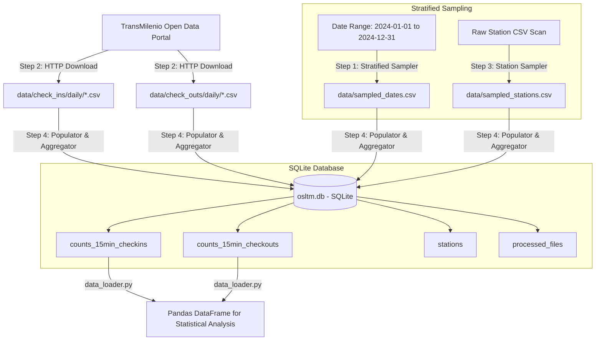

# Data Ingestion, Sampling & Persistence Pipeline

> **Document Part 1 of 4 in OSLTM Codebase Review**  
> **Master Guide Index**: [00_MASTER_INDEX_AND_ROADMAP.md](file:///d:/dequi/repositories/osltm/docs/codebase_guide/00_MASTER_INDEX_AND_ROADMAP.md)

---

## 1. Overview of Data Architecture

The data pipeline acquires raw, high-volume passenger transaction CSV files published by TransMilenio (Bogotá's Bus Rapid Transit system), processes raw timestamps into 15-minute aggregated count matrices per station, and populates a fast local SQLite database (`osltm.db`).



---

## 2. Step-by-Step Data Pipeline Breakdown

The data pipeline is orchestrated by [src/workflow/workflow.py](file:///d:/dequi/repositories/osltm/src/workflow/workflow.py) and configured via [src/workflow/params.json](file:///d:/dequi/repositories/osltm/src/workflow/params.json).

### Step 1: Stratified Date Sampling
- **Script**: [src/workflow/steps/step1_sample_dates.py](file:///d:/dequi/repositories/osltm/src/workflow/steps/step1_sample_dates.py)
- **Objective**: Ensure balanced representation across four distinct operational day types:
  - **WD**: Weekday (Monday–Friday, excluding public holidays)
  - **SA**: Saturday (excluding public holidays)
  - **SU**: Sunday (excluding public holidays)
  - **HO**: Colombian Public Holiday (parsed dynamically using the Python `holidays` package for Colombia)
- **Output**: `src/workflow/data/sampled_dates.csv` containing columns `[date, date_type, year, month, day, day_of_week]`.
- **Reproducibility**: Enforces a global random seed (`SEED = 42`) specified in `params.json`.

### Step 2: Automated Downloading of Daily Transaction Files
- **Script**: [src/workflow/steps/step2_download_files.py](file:///d:/dequi/repositories/osltm/src/workflow/steps/step2_download_files.py)
- **Objective**: Downloads raw daily CSV transaction files for the sampled dates from TransMilenio's public storage URLs.
- **Directory Structure**:
  - `data/check_ins/daily/validaciones_YYYYMMDD.csv`
  - `data/check_outs/daily/salidas_YYYYMMDD.csv`
- **Data Reduction Utility**: [src/workflow/utils/drop_unused_columns.py](file:///d:/dequi/repositories/osltm/src/workflow/utils/drop_unused_columns.py) can be executed post-download to strip unnecessary metadata columns, reducing file sizes by ~85% for check-ins and ~60% for check-outs.

### Step 3: Station Sampling & Metadata Extraction
- **Script**: [src/workflow/steps/step3_sample_stations.py](file:///d:/dequi/repositories/osltm/src/workflow/steps/step3_sample_stations.py)
- **Objective**: Scans downloaded files, extracts all unique station codes and names, and selects a designated subset for modeling (e.g., major trunk stations, feeder terminals, transfer hubs).
- **Output**: `src/workflow/data/sampled_stations.csv` containing columns `[station_code, station_name, total_records]`.

### Step 4: 15-Minute Count Binning & SQLite Population
- **Script**: [src/workflow/steps/step4_populate_counts.py](file:///d:/dequi/repositories/osltm/src/workflow/steps/step4_populate_counts.py)
- **Objective**: Parses raw timestamp transactions from CSV files, groups timestamps into 77 discrete 15-minute time intervals from 04:00 to 23:00, and inserts the count vector into SQLite.
- **Time Windows**:
  - `t_400` (04:00 - 04:15), `t_415` (04:15 - 04:30), ..., `t_2300` (23:00 - 23:15).
  - Total of 77 time bins per (date, station) record.

---

## 3. Database Schema (`osltm.db` V2 Schema)

The active database uses the **V2 Schema** defined in [src/db/session_v2.py](file:///d:/dequi/repositories/osltm/src/db/session_v2.py) and SQLAlchemy repository models in [src/repo/v2/](file:///d:/dequi/repositories/osltm/src/repo/v2).

### Schema Tables & Column Definitions

#### Table: `counts_15min_checkins` & `counts_15min_checkouts`
Stores aggregated 15-minute arrival/departure counts per station and per date.

| Column | Data Type | Description |
| :--- | :--- | :--- |
| `id` | `INTEGER` | Primary Key (Autoincrement) |
| `year` | `INTEGER` | Year (e.g., 2024) |
| `month` | `INTEGER` | Month (1 to 12) |
| `day` | `INTEGER` | Day of month (1 to 31) |
| `date_type` | `VARCHAR(10)` | Operational day type (`WD`, `SA`, `SU`, `HO`) |
| `station_code` | `VARCHAR(50)` | TransMilenio station identifier code (e.g., `03000`) |
| `t_400` ... `t_2300` | `INTEGER` | 77 count columns representing 15-minute bins from 04:00 to 23:00 |

#### Table: `stations`
Metadata repository of stations.

| Column | Data Type | Description |
| :--- | :--- | :--- |
| `station_code` | `VARCHAR(50)` | Primary Key — Station identifier code |
| `station_name` | `VARCHAR(255)` | Full human-readable station name |
| `line` / `zone` | `VARCHAR(100)` | Trunk line / geographic corridor |

#### Table: `processed_files`
Tracks downloaded and processed CSV files to prevent duplicate database population.

---

## 4. Python Data Access API (`data_loader.py`)

All exploratory scripts and point process models load data via the unified loader interface in [src/workflow/data_loader.py](file:///d:/dequi/repositories/osltm/src/workflow/data_loader.py).

### Basic Usage Examples

```python
from src.workflow.data_loader import load_data

# 1. Load all check-in counts from SQLite
data = load_data(include_checkins=True, include_checkouts=False)
checkins_df = data["checkins"]
# Returns DataFrame with columns: year, month, day, date_type, station_code, t_400, t_415, ..., t_2300

# 2. Filter for specific station codes
data = load_data(
    station_codes=["03000", "07112", "06000"],
    include_checkins=True,
    include_checkouts=True
)

# 3. Access binned count matrix as numpy array
time_cols = [c for c in checkins_df.columns if c.startswith("t_")]
count_matrix = checkins_df[time_cols].to_numpy() # Shape: (N_days, 77)
```

---

## 5. Direct Raw Transaction Reader (`data_reader.py`)

For models requiring exact event timestamps (such as the continuous-time Hawkes process), [src/workflow/data_reader.py](file:///d:/dequi/repositories/osltm/src/workflow/data_reader.py) streams raw CSV files directly:

- Parses exact event timestamps down to second/millisecond precision.
- Converts timestamps to continuous float hours in \([4.0, 23.25]\).
- Applies optional jittering for aggregated records.

---

## 6. Document Navigation Links

- Return to **Master Guide Index**: [00_MASTER_INDEX_AND_ROADMAP.md](file:///d:/dequi/repositories/osltm/docs/codebase_guide/00_MASTER_INDEX_AND_ROADMAP.md)
- Proceed to **Statistical Hypotheses & EDA**: [02_STATISTICAL_HYPOTHESES_AND_EDA.md](file:///d:/dequi/repositories/osltm/docs/codebase_guide/02_STATISTICAL_HYPOTHESES_AND_EDA.md)
- Proceed to **Stochastic Point Process Models**: [03_STOCHASTIC_POINT_PROCESS_MODELS.md](file:///d:/dequi/repositories/osltm/docs/codebase_guide/03_STOCHASTIC_POINT_PROCESS_MODELS.md)
