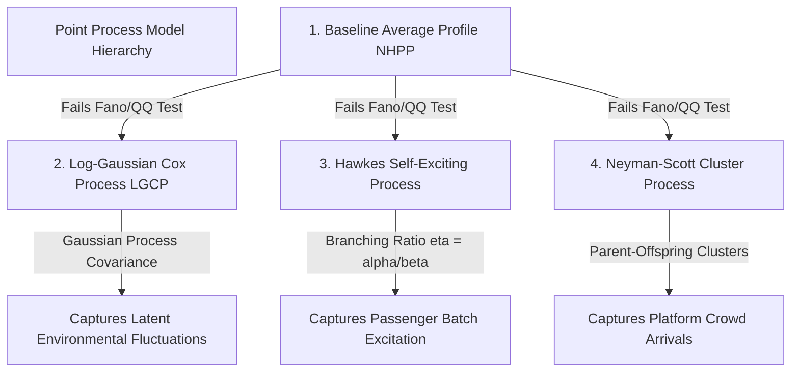
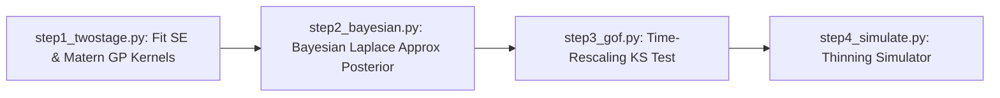

# Stochastic Point Process Models & Simulation Evaluation

> **Document Part 3 of 4 in OSLTM Codebase Review**  
> **Master Guide Index**: [00_MASTER_INDEX_AND_ROADMAP.md](file:///d:/dequi/repositories/osltm/docs/codebase_guide/00_MASTER_INDEX_AND_ROADMAP.md)

---

## 1. Overview of Point Process Models

To overcome the failure of standard Non-Homogeneous Poisson Processes (NHPP) identified in the EDA phase (due to massive overdispersion \(\text{Fano} \gg 1\)), the codebase implements a hierarchy of four stochastic point process models, alongside a network Origin-Destination (OD) gravity model.

---

## 2. Model 1: Average Profile Model (Baseline NHPP)

- **Location**: [src/workflow/scripts/models/avg_profile/](file:///d:/dequi/repositories/osltm/src/workflow/scripts/models/avg_profile)
- **Concept**: Establishes a deterministic non-homogeneous rate function \(\lambda_{s,g}(t)\) estimated by averaging 15-minute counts across replicate dates for station \(s\) and day-type \(g\):
  \[ \lambda_{s,g}(t_k) = \frac{1}{|D_g|} \sum_{d \in D_g} \frac{N_{d,s,k}}{\Delta t} \]
- **Interpolation**: Cubic B-spline / Kernel Density Estimation (KDE) to produce a smooth continuous rate function \(\lambda(t)\) over \(t \in [4.0, 23.25]\) hours.
- **Simulation**: Inhomogeneous thinning (Lewis-Shedler algorithm).
- **Role in Project**: Baseline benchmark model against which doubly-stochastic models (LGCP, Hawkes) are evaluated.

---

## 3. Model 2: Log-Gaussian Cox Process (LGCP)

- **Location**: [src/workflow/scripts/models/lgcp/](file:///d:/dequi/repositories/osltm/src/workflow/scripts/models/lgcp)
- **Concept**: A doubly-stochastic point process where the log-intensity is a Gaussian Process:
  \[ \lambda(t) = \exp\left( \mu(t) + Z(t) \right), \quad Z(t) \sim \mathcal{GP}\left( 0, K_\theta(t, t') \right) \]
  where \(\mu(t)\) is the mean log-intensity curve, and \(Z(t)\) models continuous Gaussian spatio-temporal fluctuations across replicate days.

### Four-Step Execution Pipeline

#### Step 1: Two-Stage Kernel Estimation ([step1_twostage.py](file:///d:/dequi/repositories/osltm/src/workflow/scripts/models/lgcp/step1_twostage.py))
1. Compute mean log-intensity: \(\hat{\mu}(t_k) = \log\left( \bar{N}_k + \epsilon_0 \right)\) (with continuity correction \(\epsilon_0 = 0.5\)).
2. Compute log-residuals: \(e_{j,k} = \log(N_{j,k} + \epsilon_0) - \hat{\mu}(t_k)\).
3. Estimate empirical covariance matrix across replicate days:
   \[ \hat{C}(t_k, t_l) = \frac{1}{|D_g|-1} \sum_{j \in D_g} e_{j,k} e_{j,l} \]
4. Fit parametric GP covariance kernels \(K_\theta(t, t')\) via Maximum Likelihood Estimation (MLE):
   - **Squared Exponential (SE)**:
     \[ K_{\text{SE}}(t, t') = \sigma_f^2 \exp\left( -\frac{(t - t')^2}{2 \ell^2} \right) + \sigma_n^2 \delta_{t,t'} \]
   - **Matérn 3/2**:
     \[ K_{\text{Matérn}}(t, t') = \sigma_f^2 \left( 1 + \frac{\sqrt{3}|t - t'|}{\ell} \right) \exp\left( -\frac{\sqrt{3}|t - t'|}{\ell} \right) + \sigma_n^2 \delta_{t,t'} \]

#### Step 2: Full Bayesian Inference ([step2_bayesian.py](file:///d:/dequi/repositories/osltm/src/workflow/scripts/models/lgcp/step2_bayesian.py))
Computes the latent posterior distribution of \(Z(t)\) given observed counts \(N\) via **Laplace Approximation**, finding the MAP estimate \(\hat{Z}\) by minimizing the unnormalized negative log-posterior:
\[ f(Z) = \sum_{k=1}^K \left[ \Delta t \cdot \exp(\mu_k + Z_k) - N_k (\mu_k + Z_k) \right] + \frac{1}{2} Z^T K^{-1} Z \]

#### Step 3: Goodness-of-Fit Assessment ([step3_gof.py](file:///d:/dequi/repositories/osltm/src/workflow/scripts/models/lgcp/step3_gof.py))
Evaluates the LGCP intensity against the empirical data using the Time-Rescaling Kolmogorov-Smirnov test.

#### Step 4: Synthetic Arrival Simulation ([step4_simulate.py](file:///d:/dequi/repositories/osltm/src/workflow/scripts/models/lgcp/step4_simulate.py))
Samples GP realizations \(Z \sim \mathcal{N}(0, K_\theta)\), constructs realization intensity \(\lambda(t) = \exp(\mu(t) + Z(t))\), and simulates exact arrival timestamps using Poisson thinning.

---

## 4. Model 3: Hawkes Self-Exciting Point Process

- **Location**: [src/workflow/scripts/models/hawkes/](file:///d:/dequi/repositories/osltm/src/workflow/scripts/models/hawkes)
- **Concept**: A self-exciting point process where each passenger arrival temporarily increases the probability of subsequent arrivals (modeling batch platform arrivals when buses drop off passengers):
  \[ \lambda(t | \mathcal{H}_t) = \mu(t) + \sum_{t_i < t} \alpha \exp\left( -\beta(t - t_i) \right) \]
  where:
  - \(\mu(t) = \kappa \cdot \mu_{\text{base}}(t)\) is the baseline arrival rate.
  - \(\alpha > 0\) is the excitation jump size.
  - \(\beta > 0\) is the exponential decay rate.
  - \(\eta = \frac{\alpha}{\beta}\) is the **Branching Ratio** (must be \(< 1\) for stability/subcriticality).

### Continuous-Time Log-Likelihood Engine ([core.py](file:///d:/dequi/repositories/osltm/src/workflow/scripts/models/hawkes/core.py))

The log-likelihood of a Hawkes process observed over \([0, T]\) with events \(t_1, t_2, \dots, t_N\) is:
\[ \ln L = \sum_{i=1}^N \ln \lambda(t_i | \mathcal{H}_{t_i}) - \int_0^T \lambda(t | \mathcal{H}_t) dt \]

To achieve fast performance for large event datasets (\(N \approx 50,000\)), the code computes the recurrent excitation sum \(A(i) = \sum_{j < i} \alpha \exp(-\beta(t_i - t_j))\) in **\(O(N)\) linear time** using the recursive relation:
\[ A(i) = \exp\left( -\beta(t_i - t_{i-1}) \right) \cdot \left[ A(i-1) + \alpha \right] \]

### Pipeline Steps
1. **[step1_fit.py](file:///d:/dequi/repositories/osltm/src/workflow/scripts/models/hawkes/step1_fit.py)**: Minimizes \(-\ln L\) using scipy `minimize` (L-BFGS-B) to estimate parameters \((\kappa, \alpha, \beta)\). For 15-minute checkout data, uniform random jittering is applied to convert discrete counts to continuous timestamps.
2. **[step2_diagnostics.py](file:///d:/dequi/repositories/osltm/src/workflow/scripts/models/hawkes/step2_diagnostics.py)**: Evaluates branching ratios \(\eta = \alpha/\beta\) across stations. High \(\eta\) (\(0.4 - 0.8\)) indicates strong passenger arrival clustering.
3. **[step3_simulate.py](file:///d:/dequi/repositories/osltm/src/workflow/scripts/models/hawkes/step3_simulate.py)**: Simulates synthetic Hawkes event streams using Ogata's modified thinning algorithm.

---

## 5. Model 4: Neyman-Scott Cluster Point Process

- **Location**: [src/workflow/scripts/models/cluster/](file:///d:/dequi/repositories/osltm/src/workflow/scripts/models/cluster)
- **Concept**: A spatial/temporal cluster process where parent events (e.g., bus arrivals) occur according to a Poisson process with rate \(\mu_P(t)\), and each parent generates a random number of offspring events (passengers) distributed according to a kernel function \(h(t - t_p)\).

---

## 6. Model 5: Origin-Destination (OD) Gravity Model

- **Location**: [src/workflow/scripts/od/gravity_od.py](file:///d:/dequi/repositories/osltm/src/workflow/scripts/od/gravity_od.py)
- **Concept**: Models passenger trip volume \(T_{ij}\) between origin station \(i\) and destination station \(j\):
  \[ T_{ij} = k \cdot \frac{O_i^\alpha \cdot D_j^\beta}{f(d_{ij})} \]
  where \(O_i\) is total check-in count at origin \(i\), \(D_j\) is total check-out count at destination \(j\), \(d_{ij}\) is network travel distance, and \(f(d_{ij}) = d_{ij}^\gamma\) (or \(\exp(\gamma d_{ij})\)) is the spatial friction/impedance function.

---

## 7. Goodness-of-Fit Metric Evaluator (`simulation_comparison.py`)

The cross-model evaluation framework in [src/workflow/scripts/models/simulation_comparison.py](file:///d:/dequi/repositories/osltm/src/workflow/scripts/models/simulation_comparison.py) compares simulated 15-minute count profiles against observed empirical test counts across **7 statistical metrics**:

| Metric | Mathematical Formula | Purpose / Interpretation |
| :--- | :--- | :--- |
| **MAE** | \(\frac{1}{K}\sum_{k=1}^K \|N_k^{\text{obs}} - N_k^{\text{sim}}\|\) | Mean Absolute Error (in passengers per bin). |
| **RMSE** | \(\sqrt{\frac{1}{K}\sum_{k=1}^K (N_k^{\text{obs}} - N_k^{\text{sim}})^2}\) | Root Mean Squared Error (penalizes large peak errors). |
| **MAPE** | \(\frac{100\%}{K}\sum_{k=1}^K \frac{\|N_k^{\text{obs}} - N_k^{\text{sim}}\|}{N_k^{\text{obs}} + \epsilon}\) | Mean Absolute Percentage Error. |
| **Pearson \(r\)** | \(\frac{\text{Cov}(N^{\text{obs}}, N^{\text{sim}})}{\sigma_{\text{obs}} \sigma_{\text{sim}}}\) | Profile shape correlation (\(r \to 1.0\) indicates perfect shape alignment). |
| **Count Ratio** | \(\frac{\sum_{k=1}^K N_k^{\text{sim}}}{\sum_{k=1}^K N_k^{\text{obs}}}\) | Total daily volume fidelity (Ideal = \(1.0\)). |
| **Wasserstein Distance** | \(W_1(P_{\text{obs}}, P_{\text{sim}})\) | Earth Mover's Distance between empirical and simulated count distributions. |
| **\(\pm 2\sigma\) Coverage** | \(\frac{1}{K}\sum_{k=1}^K \mathbb{I}\left( N_k^{\text{obs}} \in [\mu_k^{\text{sim}} \pm 2\sigma_k^{\text{sim}}] \right)\) | Percentage of observed counts falling within the model's 95% predictive interval (Ideal \(\approx 95\%\)). |

---

## 8. Document Navigation Links

- Return to **Master Guide Index**: [00_MASTER_INDEX_AND_ROADMAP.md](file:///d:/dequi/repositories/osltm/docs/codebase_guide/00_MASTER_INDEX_AND_ROADMAP.md)
- Return to **Data Pipeline Details**: [01_DATA_PIPELINE_AND_PERSISTENCE.md](file:///d:/dequi/repositories/osltm/docs/codebase_guide/01_DATA_PIPELINE_AND_PERSISTENCE.md)
- Return to **Statistical Hypotheses & EDA**: [02_STATISTICAL_HYPOTHESES_AND_EDA.md](file:///d:/dequi/repositories/osltm/docs/codebase_guide/02_STATISTICAL_HYPOTHESES_AND_EDA.md)
