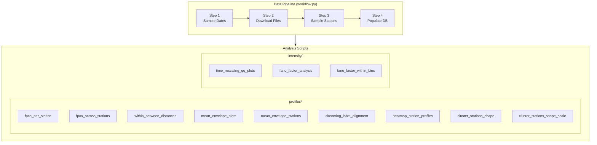

# OSLTM Workflow — Complete Script Reference

> **Project:** Modelación Estocástica con Procesos de Puntos y Redes de Colas para la Simulación del Sistema de TransMilenio

---

## Architecture Overview



All scripts are run via:
```
uv run python -m src.workflow.<module_path> [args]
```

---

## 1. Data Pipeline

### 1.1 Orchestrator — [workflow.py](file:///d:/dequi/repositories/osltm/src/workflow/workflow.py)

Runs steps 1–4 sequentially. Loads [params.json](file:///d:/dequi/repositories/osltm/src/workflow/params.json) and passes the params dict to each step.

```
uv run python -m src.workflow.workflow --params src/workflow/params.json --steps 1,2,3,4
```

| Arg | Default | Purpose |
|-----|---------|---------|
| `--params` | [src/workflow/params.json](file:///d:/dequi/repositories/osltm/src/workflow/params.json) | Config file |
| `--steps` | all | Which steps to run (comma-separated ints 1–4) |

---

### 1.2 [step1_sample_dates.py](file:///d:/dequi/repositories/osltm/src/workflow/steps/step1_sample_dates.py) — Stratified Date Sampling

**Purpose:** Sample dates from a range, stratified by day type (WD/SA/SU/HO), so each type is represented proportionally.

| [params.json](file:///d:/dequi/repositories/osltm/src/workflow/params.json) key | Default | Purpose |
|--------------------|---------|---------|
| `start_date` | `"2024-06-25"` | Start of date range |
| `end_date` | `"2026-01-31"` | End of date range |
| `n_per_stratum` | `10` | Dates to sample per day-type stratum |
| `days_offset` | `0` | Offset from start |
| `seed` | `42` | Random seed |

**Output:** [src/workflow/data/sampled_dates.csv](file:///d:/dequi/repositories/osltm/src/workflow/data/sampled_dates.csv) + updates `params["sampled_dates"]`.

---

### 1.3 [step2_download_files.py](file:///d:/dequi/repositories/osltm/src/workflow/steps/step2_download_files.py) — Download Daily CSV Files

**Purpose:** Download daily check-in/checkout CSV files from public URLs for each sampled date. Optionally unzips and drops unused columns to save ~60–85% storage.

| `params["step2"]` key | Default | Purpose |
|------------------------|---------|---------|
| [type](file:///d:/dequi/repositories/osltm/src/workflow/scripts/intensity/fano_factor_within_bins.py#41-81) | `"both"` | `"ins"`, `"outs"`, or `"both"` |
| `ins_path` | `"data/check_ins/daily"` | Where to store check-in files |
| `outs_path` | `"data/check_outs/daily"` | Where to store check-out files |
| `force_redownload` | `false` | Re-fetch even if file exists |
| `drop_columns` | `true` | Drop unnecessary columns to reduce file size |
| [process_checkins](file:///d:/dequi/repositories/osltm/src/workflow/steps/step4_populate_counts.py#181-294) | `true` | Whether to download checkins |
| [process_checkouts](file:///d:/dequi/repositories/osltm/src/workflow/steps/step4_populate_counts.py#296-414) | `true` | Whether to download checkouts |

---

### 1.4 [step3_sample_stations.py](file:///d:/dequi/repositories/osltm/src/workflow/steps/step3_sample_stations.py) — Sample Stations

**Purpose:** Scan downloaded checkout files, collect unique stations, and sample a subset for analysis.

| `params["step3"]` key | Default | Purpose |
|------------------------|---------|---------|
| `n_files` | `5` | Number of files to scan for station discovery |
| `n_stations` | `10` | Number of stations to sample |
| `reference_csv_path` | `"src/workflow/data/all_stations.csv"` | Save all found stations here |
| `seed` | `42` | Random seed |

**Output:** [src/workflow/data/sampled_stations.csv](file:///d:/dequi/repositories/osltm/src/workflow/data/sampled_stations.csv) + updates `params["sampled_stations"]`.

---

### 1.5 [step4_populate_counts.py](file:///d:/dequi/repositories/osltm/src/workflow/steps/step4_populate_counts.py) — Populate Database

**Purpose:** Process downloaded CSVs for sampled dates & stations, compute 15-min bin counts, and upsert into the database via SQLAlchemy.

| `params["step4"]` key | Default | Purpose |
|------------------------|---------|---------|
| `persistence_dir` | `"src/workflow/data"` | Where to read sampled dates/stations |
| [process_checkins](file:///d:/dequi/repositories/osltm/src/workflow/steps/step4_populate_counts.py#181-294) | `true` | Process check-in files |
| [process_checkouts](file:///d:/dequi/repositories/osltm/src/workflow/steps/step4_populate_counts.py#296-414) | `true` | Process check-out files |
| `time_min` | `400` | Start of day in HHMM (04:00) |
| `time_max` | `2300` | End of day in HHMM (23:00) |

---

## 2. Data Modules

### [data_loader.py](file:///d:/dequi/repositories/osltm/src/workflow/data_loader.py)

Loads count data **from the database** into DataFrames. Returns a dict with `"checkins"` and/or `"checkouts"` DataFrames where columns are `year, month, day, date_type, station_code, station_name, t_400, t_415, ...`.

### [data_reader.py](file:///d:/dequi/repositories/osltm/src/workflow/data_reader.py)

Loads raw transaction data **from CSV files**. Parses timestamps, extracts station info.

---

## 3. Profile Analysis Scripts

> All in `src/workflow/scripts/profiles/`. Operate on 15-min count profiles from the DB.

### 3.1 [fpca_per_station.py](file:///d:/dequi/repositories/osltm/src/workflow/scripts/profiles/fpca_per_station.py)

**Purpose:** FPCA on daily profiles for **each station individually**. Points colored by date type reveal whether day types separate in principal component space.

```
uv run python -m src.workflow.scripts.profiles.fpca_per_station \
  --stations 001 002 --count_type checkins --n_components 3
```

| Arg | Default | Purpose |
|-----|---------|---------|
| `--count_type` | `checkins` | `checkins` or `checkouts` |
| `--n_components` | `3` | Number of PCs to extract |
| `--no_standardize` | flag | Skip standardization before PCA |
| `--output_dir` | `src/workflow/results/fpca_results` | Where to save plots |
| `--params` | `src/workflow/params.json` | Config file |
| `--stations` | all | Subset of station codes to analyze |

---

### 3.2 [fpca_across_stations.py](file:///d:/dequi/repositories/osltm/src/workflow/scripts/profiles/fpca_across_stations.py)

**Purpose:** FPCA on **all (station, day) profiles together**. Scatter colored by station, faceted by day type. Shows inter-station variability.

```
uv run python -m src.workflow.scripts.profiles.fpca_across_stations \
  --stations 001 002 --day_types WD SA
```

| Arg | Default | Purpose |
|-----|---------|---------|
| `--count_type` | `checkins` | `checkins` or `checkouts` |
| `--n_components` | `3` | Number of PCs |
| `--no_standardize` | flag | Skip standardization |
| `--output_dir` | `src/workflow/results/fpca_results` | Output dir |
| `--params` | `src/workflow/params.json` | Config file |
| `--stations` | all | Station filter |
| `--day_types` | all | Filter to specific day types (`WD SA SU HO`) |

---

### 3.3 [within_between_distances.py](file:///d:/dequi/repositories/osltm/src/workflow/scripts/profiles/within_between_distances.py)

**Purpose:** Compute ratio R = mean(within-group distance) / mean(between-group distance), where groups are day types. **R < 1 → good separation** of day types in profile space.

```
uv run python -m src.workflow.scripts.profiles.within_between_distances \
  --stations 001 --count_type checkouts
```

| Arg | Default | Purpose |
|-----|---------|---------|
| `--count_type` | `checkins` | `checkins` or `checkouts` |
| `--output_dir` | `src/workflow/results/distance_results` | Output dir |
| `--params` | `src/workflow/params.json` | Config file |
| `--stations` | all | Station filter |
| `--no_plot` | flag | Skip plotting |

---

### 3.4 [mean_envelope_plots.py](file:///d:/dequi/repositories/osltm/src/workflow/scripts/profiles/mean_envelope_plots.py)

**Purpose:** For **each station**, overlay mean ± envelope (std or quantile) for each day type on a single plot. Shows typical pattern and variability per station.

| Arg | Default | Purpose |
|-----|---------|---------|
| `--count_type` | `checkins` | `checkins` or `checkouts` |
| `--envelope_type` | `std` | `std` (±1σ) or `quantile` (10–90%) |
| `--quantile_low` | `0.1` | Lower quantile bound |
| `--quantile_high` | `0.9` | Upper quantile bound |
| `--output_dir` | `src/workflow/results/envelope_results` | Output dir |
| `--params` | `src/workflow/params.json` | Config file |
| `--stations` | all | Station filter |

---

### 3.5 [mean_envelope_stations.py](file:///d:/dequi/repositories/osltm/src/workflow/scripts/profiles/mean_envelope_stations.py)

**Purpose:** Faceted by day type, overlay **multiple stations** on the same plot (each with mean ± envelope). Cross-station comparison within each day type.

| Arg | Default | Purpose |
|-----|---------|---------|
| `--count_type` | `checkins` | `checkins` or `checkouts` |
| `--envelope_type` | `std` | `std` or `quantile` |
| `--quantile_low` | `0.1` | Lower quantile |
| `--quantile_high` | `0.9` | Upper quantile |
| `--output_dir` | `src/workflow/results/envelope_results` | Output dir |
| `--params` | `src/workflow/params.json` | Config file |
| `--stations` | all | Station filter |
| `--day_types` | all | Day type filter (`WD SA SU HO`) |

---

### 3.6 [clustering_label_alignment.py](file:///d:/dequi/repositories/osltm/src/workflow/scripts/profiles/clustering_label_alignment.py)

**Purpose:** K-Means clustering on daily profiles, then compare cluster labels to day-type labels via Adjusted Rand Index, confusion matrix, purity, and entropy. Answers: *Do clusters match the WD/SA/SU/HO taxonomy?*

| Arg | Default | Purpose |
|-----|---------|---------|
| `--count-type` | `in` | `in` or `out` (note: different from other scripts!) |
| `--n-clusters` | `3` | Number of clusters |
| `--stations` | all | Station filter |
| `--output-dir` | `src/workflow/results/clustering_results` | Output dir |
| `--no-normalize` | flag | Skip normalization before clustering |
| `--seed` | `42` | Random seed |

---

### 3.7 [heatmap_station_profiles.py](file:///d:/dequi/repositories/osltm/src/workflow/scripts/profiles/heatmap_station_profiles.py)

**Purpose:** Heatmap (rows = stations, cols = time bins) of **mean** profiles for a fixed day type. Quick visual overview of all stations.

| Arg | Default | Purpose |
|-----|---------|---------|
| `--count_type` | `checkins` | `checkins` or `checkouts` |
| `--day_type` | `WD` | Single day type to visualize |
| `--output_dir` | `src/workflow/results/heatmap_results` | Output dir |
| `--params` | `src/workflow/params.json` | Config file |
| `--stations` | all | Station filter |
| `--cmap` | `YlOrRd` | Matplotlib colormap |
| `--figsize` | auto | Manual figure size (WIDTH HEIGHT) |

---

### 3.8 [cluster_stations_shape.py](file:///d:/dequi/repositories/osltm/src/workflow/scripts/profiles/cluster_stations_shape.py)

**Purpose:** **Shape-based** clustering. Normalizes profiles by total (→ proportions summing to 1), applies FPCA, then Ward hierarchical clustering. Groups stations with similar *shapes* regardless of scale.

| Arg | Default | Purpose |
|-----|---------|---------|
| `--count_type` | `checkins` | `checkins` or `checkouts` |
| `--day_type` | `WD` | Day type to cluster on |
| `--n_clusters` | `4` | Number of clusters |
| `--n_components` | all | Number of FPCA components |
| `--output_dir` | `src/workflow/results/clustering_results` | Output dir |
| `--params` | `src/workflow/params.json` | Config file |
| `--stations` | all | Station filter |

---

### 3.9 [cluster_stations_shape_scale.py](file:///d:/dequi/repositories/osltm/src/workflow/scripts/profiles/cluster_stations_shape_scale.py)

**Purpose:** **Shape + scale** clustering. Applies `log(x+1)` transform (preserves relative differences) then Ward clustering. Groups stations that are similar in both shape **and** volume.

| Arg | Default | Purpose |
|-----|---------|---------|
| `--count_type` | `checkins` | `checkins` or `checkouts` |
| `--day_type` | `WD` | Day type to cluster on |
| `--n_clusters` | `4` | Number of clusters |
| `--output_dir` | `src/workflow/results/clustering_results` | Output dir |
| `--params` | `src/workflow/params.json` | Config file |
| `--stations` | all | Station filter |

---

## 4. Intensity Analysis Scripts

> All in `src/workflow/scripts/intensity/`. Test whether arrival processes follow Poisson assumptions.

### 4.1 [time_rescaling_qq_plots.py](file:///d:/dequi/repositories/osltm/src/workflow/scripts/intensity/time_rescaling_qq_plots.py)

**Purpose:** Apply the time rescaling theorem. If the estimated intensity is correct, rescaled inter-event times → Uniform(0,1). QQ-plots and KS test validate this.

> [!WARNING]
> **Only supports checkins.** Checkouts have 15-min granularity and lack raw timestamps.

```
uv run python -m src.workflow.scripts.intensity.time_rescaling_qq_plots \
  --stations 001 --date_percentage 0.3
```

| Arg | Default | Purpose |
|-----|---------|---------|
| `--output_dir` | `src/workflow/results/time_rescaling` | Output dir |
| `--params` | `src/workflow/params.json` | Config file |
| `--stations` | all | Station filter |
| `--data_dir` | `data/check_ins/daily` | CSV directory |
| `--time_window_minutes` | `15.0` | Bin size for intensity estimation |
| `--date_percentage` | all | Fraction of dates per day type (0.0–1.0). **Key performance knob.** |

**Reasoning for `--date_percentage`:** Processing every raw CSV is expensive. This samples a fraction per day type to speed up experiments while keeping day-type balance.

---

### 4.2 [fano_factor_analysis.py](file:///d:/dequi/repositories/osltm/src/workflow/scripts/intensity/fano_factor_analysis.py)

**Purpose:** Fano factor = Var(N)/E(N) **across days** for each 15-min bin. Poisson → Fano ≈ 1. Fano > 1 → overdispersion. Plots median Fano vs time-of-day for each day type.

```
uv run python -m src.workflow.scripts.intensity.fano_factor_analysis \
  --count_type checkins --stations 001 002
```

| Arg | Default | Purpose |
|-----|---------|---------|
| `--count_type` | `checkins` | `checkins` or `checkouts` |
| `--output_dir` | `src/workflow/results/fano_factor` | Output dir |
| `--params` | `src/workflow/params.json` | Config file |
| `--stations` | all | Station filter |

---

### 4.3 [fano_factor_within_bins.py](file:///d:/dequi/repositories/osltm/src/workflow/scripts/intensity/fano_factor_within_bins.py)

**Purpose:** Fano factor **within** each 15-min bin by subdividing into δ-minute sub-bins. Per file/station, counts events in each sub-bin, then Var/Mean. Plots median ± envelope vs time-of-day.

```
uv run python -m src.workflow.scripts.intensity.fano_factor_within_bins \
  --count_type checkins --time_step 15 --delta_minutes 1 --date_percentage 0.3
```

| Arg | Default | Purpose |
|-----|---------|---------|
| `--count_type` | `checkins` | `checkins` or `checkouts` |
| `--output_dir` | `src/workflow/results/fano_factor_within_bins` | Output dir |
| `--params` | `src/workflow/params.json` | Config file |
| `--stations` | all | Station filter |
| `--data_dir` | `data/check_ins/daily` | CSV dir (checkins only; checkouts use DB) |
| `--date_percentage` | all | Fraction of dates per day type |
| `--time_step` | from params or `15` | Outer bin size (minutes) |
| `--delta_minutes` | from params or `1` | Sub-bin size (minutes) |
| `--envelope_type` | `quantile` | `std` or `quantile` |
| `--quantile_low` | `0.25` | Lower quantile |
| `--quantile_high` | `0.75` | Upper quantile |

---

## 5. Common Parameter Patterns

| Parameter | Appears In | Reasoning |
|-----------|------------|-----------|
| `--stations` | All analysis scripts | Limit to specific stations → faster iteration |
| `--count_type` | All analysis scripts | Toggle between checkins and checkouts |
| `--date_percentage` | Intensity scripts | Sample dates proportionally → faster experiments |
| `--day_type(s)` | Several profile scripts | Focus on specific day types (WD, SA, SU, HO) |
| `--n_components` | FPCA scripts | Control dimensionality reduction depth |
| `--n_clusters` | Clustering scripts | Set number of clusters |
| `--envelope_type` | Envelope/Fano scripts | Choose `std` (±1σ) vs `quantile` variance bands |
| `--no_standardize` | FPCA scripts | Keep original scale (useful when scale matters) |
| `--output_dir` | All scripts | Redirect output to custom directory |
| `--params` | All scripts | Point to an alternate `params.json` |
